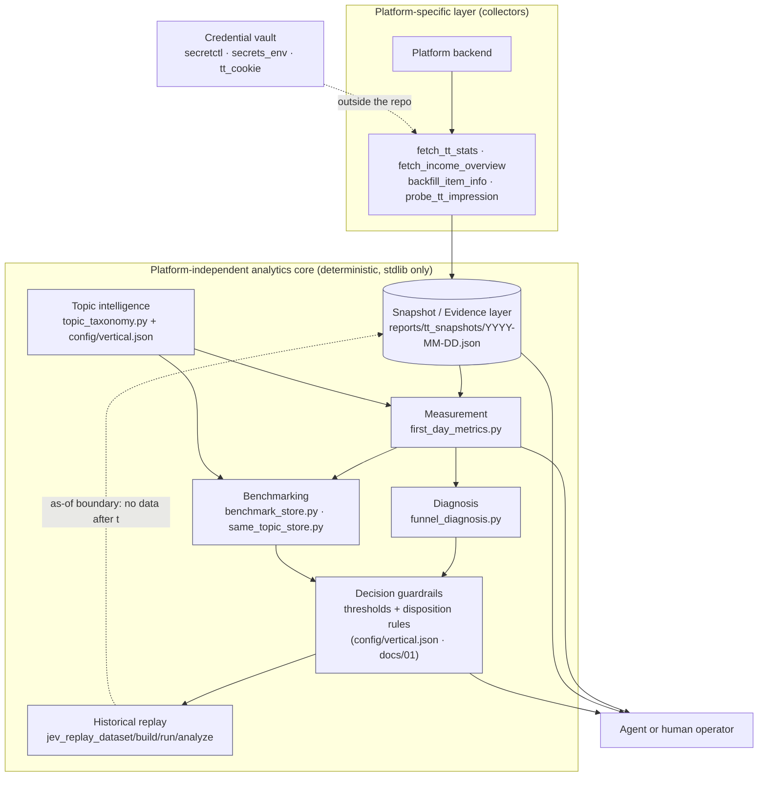

# ContentOps Loop

**Agent-compatible content intelligence & decision engine.**

Measure → Diagnose → Act → Replay

> **Use code for facts. Use agents for judgment.**

English | [简体中文](README.zh-CN.md)

<!--
  Badge note: the CI badge below can only be truthful after YOU push and the first run finishes.
  Replace <you> and <repo>, then uncomment:
  [](https://github.com/<you>/<repo>/actions/workflows/ci.yml)
-->


---

## Why this project exists

Most content analytics tools answer *"what are the numbers?"* — a dashboard, a chart, a daily digest.
That is the easy half. The hard half is **deciding what to do next**, and doing it the same way every time
instead of re-deriving the judgement from scratch each morning while being nudged by whatever looked
interesting this week.

ContentOps Loop is built around that second half. It is a small, deterministic pipeline that:

- turns platform data into a **stable, versioned snapshot** (evidence),
- derives a **single measurement window** so two articles are actually comparable,
- produces a **diagnosis with a prescribed action**, not just a chart,
- keeps **benchmarks and topic vocabularies** as data, not hardcoded assumptions,
- and can **replay history** to check whether a proposed rule would actually have helped —
  without leaking the future into the past.

It grew out of a real content operation that runs every day, which is why it is opinionated about
failure modes: missing credentials, empty upstream responses, insufficient samples, and the temptation
to draw conclusions from three data points.

**What it is not:** it is not an autopilot that writes and publishes for you, and it is not a
no-code dashboard. There is no LLM in the measurement path.

---

## Quick start — zero credentials, no network, no API key, no database

Everything below runs on the bundled synthetic dataset (a pet-content vertical, 9 days, 37 articles).
No platform account, no cookie, no LLM.

```bash
git clone https://github.com/<you>/contentops-loop.git
cd contentops-loop

# 1. Environment check + create the workspace directories
python3 scripts/doctor.py --init

# 2. THE demo: measurement + topic pool table from synthetic snapshots
CONTENT_OPS_ROOT=examples python3 scripts/first_day_metrics.py
```

That single command is the core of the project. It prints (real output, synthetic data):

```text
FIRSTDAY_OK (口径=首日曝光/首日阅读/首日CTR；快照 2026-01-13，可比样本 17 篇)
近5篇首日曝光中位 609｜近30天中位 865｜近5篇首日CTR中位 7.05%｜近30天 7.38%｜近14天CTR≥4%过线率 100.0%（17篇）

| 发布 | 题材 | 标题 | 首日曝光 | 首日阅读 | 首日CTR | 累计展 | 累计读 | 累计CTR |
|---|---|---|---|---|---|---|---|---|
| 2026-01-10 | 养猫日常 | 猫粮换了三个牌子，它终于肯吃了 | 1035 | 73 | 7.05% | 1536 | 79 | 5.14% |
| 2026-01-09 | 宠物训练 | 教了半年握手，它只学会了装听不懂 | 474 | 33 | 6.96% | 1090 | 39 | 3.58% |
| 2026-01-09 | 多宠与相处 | 新猫进门第七天，旧猫终于肯跟它一起睡了 | 609 | 59 | 9.69% | 1505 | 74 | 4.92% |
| 2026-01-09 | 多宠与相处 | 两只猫抢窝，我把猫爬架挪了个位置 | 554 | 28 | 5.05% | 1254 | 38 | 3.03% |

题材池子表（按「剔爆款后首日曝光中位」降序 = 池子大小序）：
| 题材 | 篇数 | 首日曝光中位(剔爆款) | 首日曝光中位(含爆款) | 首日阅读中位 | 首日CTR中位 | 备注 |
|---|---|---|---|---|---|---|
| 养猫日常 | 3 | 1178 | 1178 | 73 | 7.05% |  |
| 养狗日常 | 2 | 1130.0 | 1130.0 | 100.5 | 8.8% | |
| 宠物健康 | 3 | 908 | 908 | 67 | 7.38% | |
| 领养救助 | 2 | 851.0 | 851.0 | 74.0 | 8.71% | |
| 多宠与相处 | 2 | 581.5 | 581.5 | 43.5 | 7.37% | |
| 宠物殡葬离别 | 1 | 305 | 305 | 18 | 5.9% | 单篇 |
| 宠物消费 | 1 | 263 | 263 | 13 | 4.94% | 单篇 |
```

(Report labels are in Chinese because the project's first platform and vertical are Chinese-language.
The pipeline itself is locale-agnostic.)

**Why this output matters.** Look at the last two rows: *click-through is fine* (5.9% and 4.94%,
above the 4% pass line) but *early distribution was small* (305 and 263). A cumulative-metrics dashboard
lumps those two articles in with a genuinely bad one and calls it "underperforming". The pipeline
separates **"not distributed"** from **"not clicked"** because the corrective action is opposite:
one should be re-published with a new title/cover, the other needs different content.

More zero-credential things you can try:

```bash
python3 scripts/vertical.py                                  # inspect the vertical vocabulary + thresholds
python3 scripts/topic_taxonomy.py "我家橘猫半夜踩脸，一夜没睡好"   # deterministic classifier
python3 scripts/doctor.py --strict                           # exits non-zero if required items are missing (CI-friendly)
python3 -m unittest discover -s tests -v                     # the test suite
```

---

## Core architecture

Two layers, deliberately separated: **platform-specific collectors** and a **platform-independent
analytics core**. The core never talks to a platform; it only reads snapshots.



Two things the diagram is trying to say:

1. **The core is a pure function of snapshots.** If you can produce snapshots in the documented shape,
   you can use everything downstream — measurement, diagnosis, benchmarking, replay — without the collector.
2. **Replay feeds back into the evidence layer with a hard boundary.** A replay unit at time *t* may only
   see data available at *t*; the framework checks this rather than trusting the analyst to remember.

---

## Core capabilities

### Measurement

`scripts/first_day_metrics.py` — a single, consistent analysis window per article.

- First-day window (publish ≤ 12:00 → same day; later → next day), so half-day data is never compared
  against full-day data.
- Source preference: platform per-day traffic data first, snapshot value as a documented *lower bound*.
- De-duplication by title (the same item can appear twice within a minute).
- **Viral exclusion** for pool statistics: a single outlier is kept out of the "stable" median, so one
  lucky article cannot make a small topic look like a big one.
- Sample-size discipline: topics with too few samples are labelled, not scored.

### Diagnosis

`scripts/funnel_diagnosis.py` — walks the funnel (distribution → click → read-through → interaction)
and reports where it breaks, with the *kind* of break named, so the action follows from the diagnosis.

The disposition table lives in `docs/01-诊断口径.md` and its numeric thresholds live in
`config/vertical.json`. See *Design principles* below for what this framework does and does not claim.

### Topic intelligence

`scripts/topic_taxonomy.py` + `config/vertical.json` — deterministic keyword classification into
topic family + motif, with the matched keywords and a confidence level returned alongside every result.

Deliberately **not** an LLM classifier: classification decides which statistics get computed, so it has
to be auditable, reproducible, and fixable with a one-line vocabulary edit. Unmatched titles are reported
as `未归类` (unclassified) — the tool never guesses.

Swapping verticals means editing one JSON file; the scripts do not change.

### Benchmarking

`scripts/benchmark_store.py` — stores comparable external articles and computes quantiles **within the
same article-age bucket**, because a 2-hour-old article and a 3-week-old article are not comparable.
Buckets below the minimum sample size report "insufficient sample" instead of a number.
`same_topic_store.py` / `same_topic_report.py` / `same_topic_weekly.py` add a per-motif view.

### Decision guardrails

Not a module — a **specification layer**, and that is the point. The rules are written down in one place
(`docs/01-诊断口径.md`) and their numbers in one place (`config/vertical.json`), so they can be reviewed,
argued with, and changed deliberately:

- one explicit disposition per article instead of a vague "performance was mixed";
- frequency caps (e.g. re-publishing the same article at most once per week);
- a stop-gate with a **veto condition** — the gate explicitly refuses to fire when click-through is
  healthy, so a distribution problem cannot be mistaken for a content problem;
- thresholds are calibration outputs, not constants: they are expected to be re-calibrated per vertical.

### Historical replay

`scripts/jev_replay_dataset.py` · `jev_replay_build.py` · `jev_replay_run.py` · `jev_replay_analyze.py`

A harness for asking *"would this rule have helped?"* before adopting it:

- builds replay units at time *t* from only the data available at *t* (as-of slicing);
- runs a candidate evaluator (rule engine, or an optional external model) over those units;
- reports incremental value and explicitly checks for **future-information leakage**.

It has been used to reject, not just to adopt: an external title-scoring service was measured on
replayed history and showed no incremental signal, so it was not integrated.

---

## Agent integration

**Agent-compatible, not an agent runtime.** This project does not ship an autonomous agent, an MCP
server, or a planner. It ships a **deterministic core with an agent-first CLI**, designed so that an
agent (or cron, or CI, or a human) can drive it safely:

| Property | How it is implemented |
|---|---|
| Machine-readable outcomes | `PREFIX:` lines on stdout (`COOKIE_EXPIRED:`, `SNAPSHOT:`, `FIRSTDAY_OK`, `DONE:` …) |
| Unambiguous failure | unified exit codes — `0` OK, `10` credential, `20` upstream, `30` bad data, `40` insufficient data, `50` config, `60` integrity, `64` usage (`scripts/exitcodes.py`) |
| Structured results | `--json` output, stable on-disk JSON contracts (`schemas/`) |
| Facts are not recomputed | scripts emit the numbers; an agent is instructed to cite them, never to recompute |
| Self-check first | `scripts/doctor.py [--strict]` reports environment/dependency/data readiness before anything runs |
| Config vs mechanism | vocabulary and thresholds live in `config/vertical.json`; an agent may edit data, not logic |

A minimal daily loop:

```bash
python3 scripts/fetch_tt_stats.py                          # collect → snapshot
python3 scripts/first_day_metrics.py --json reports/first_day.json
# feed the stdout of both into your agent, with instructions to
# (a) assign each new article a disposition, (b) name one decision for tomorrow,
# (c) say "insufficient sample" instead of guessing.
```

See `docs/05-真实cron-prompt脱敏.md` for five sanitized production prompts (script-injected review,
single-outlet weekly decision, rebuttal-driven weekly card, evidence distillation, and a no-LLM
watchdog), plus the eleven prompt patterns worth copying. *(That document is in Chinese.)*

---

## Zero-credential demo

The `examples/` directory is a **synthetic** dataset: 37 articles across 9 days, in the same layout the
real pipeline writes to. It exists so the core can be exercised end-to-end without touching a platform.

```bash
CONTENT_OPS_ROOT=examples python3 scripts/doctor.py
CONTENT_OPS_ROOT=examples python3 scripts/first_day_metrics.py
```

`CONTENT_OPS_ROOT` selects the workspace root (default `~/content-ops-loop`), so the code and the data
can live anywhere.

---

## Credential management

The core is credential-free. Only the collectors need a session, and the repository is designed so
credentials never enter it:

1. **Runtime copy outside the repo** — `~/.cheat-secrets/tt_mp_cookies.txt` (mode 600), read by
   `scripts/tt_cookie.py`.
2. **Optional encrypted vault** — `scripts/secretctl.py` stores secrets with AES-256-GCM, one nonce per
   entry plus a truncated SHA-256 integrity check. The **master key lives outside the repository**
   (`~/.cheat-secrets/master.key`), so the vault file itself is safe to back up or publish.
3. `.gitignore` excludes the vault, `*.env`, `*.key`, and the `reports/` data directory by default.

If the master key is lost, the vault cannot be opened — by design. Back it up separately.

---

## Platform support

**Today: Toutiao (头条号) is the only implemented collector.** It is the first platform adapter, not the
architecture. Concretely:

| Layer | Status |
|---|---|
| Analytics core (measurement, diagnosis, taxonomy, benchmarking, replay) | Platform-independent — reads snapshot JSON only |
| Snapshot schema | Documented in `schemas/snapshot.schema.json` |
| Collectors | Toutiao-specific HTTP endpoints (`fetch_tt_stats.py`, `fetch_income_overview.py`, …) |
| Optional integrations | Android device automation (`phone_ctl.py`), external evaluator for replay experiments |

No other platform is claimed to work. Adding one means writing a collector that emits the same snapshot
shape; the core does not need to change.

---

## Design principles

1. **Facts before judgment.** Collectors and analyzers emit evidence; they do not emit opinions.
   Direction changes are a separate, rate-limited step.
2. **Deterministic where possible.** Same input → same output. Keyword vocabularies instead of an LLM
   classifier; documented thresholds instead of vibes; platform timestamps interpreted in a fixed
   platform timezone (`scripts/platform_time.py`) so the *host machine* cannot change the analysis.
3. **Never hide insufficient evidence.** Sample-size guards return "insufficient sample" rather than a
   number that looks usable. Exit code `40` exists for exactly this state.
4. **Leakage-safe replay.** A replay unit can only see what existed at its own point in time, and the
   framework checks the boundary instead of trusting the operator.
5. **Agents consume evidence instead of inventing facts.** Metrics are computed once, by code, and
   quoted downstream.

### What the diagnostic framework does *not* claim

The decomposition in `docs/MEASUREMENT.md` (English) / `docs/01-诊断口径.md` (Chinese) — early
distribution ≈ structure freshness × topic pool size × account-level allocation — is a **working
diagnostic framework**, not a statistically estimated causal model. The terms are not independent and
their coefficients are not identified from observational data. Its value is that it forces different
failure causes to be examined separately. All platform-side explanations are labelled as
interpretations, not as documented platform behaviour.

---

## Project structure

```text
contentops-loop/
├── scripts/                    # 27 scripts: collectors, analytics core, vault, tooling
│   ├── first_day_metrics.py    #   measurement (the core of the project)
│   ├── funnel_diagnosis.py     #   diagnosis
│   ├── topic_taxonomy.py       #   topic classification (deterministic)
│   ├── benchmark_store.py      #   age-bucketed benchmarking
│   ├── same_topic_*.py         #   per-motif library + weekly card
│   ├── jev_replay_*.py         #   leakage-safe historical replay
│   ├── secretctl.py            #   encrypted credential vault
│   ├── secrets_env.py          #   vault read API
│   ├── tt_cookie.py            #   session lookup (outside-repo first)
│   ├── exitcodes.py            #   unified exit-code semantics
│   ├── platform_time.py        #   platform timezone (not the host's) — determinism
│   ├── vertical.py             #   vertical vocabulary/threshold loader
│   ├── doctor.py               #   environment self-check
│   └── fetch_*.py, probe_*.py  #   platform-specific collectors
├── config/
│   ├── vertical.json           # ★ topic vocabulary + thresholds (edit this to change vertical)
│   └── README.md
├── schemas/                    # machine-readable contracts for the data boundaries
├── examples/                   # synthetic dataset — runs with zero credentials
├── tools/                      # CI hygiene checks (also runnable locally)
│   ├── check_core_imports.py   #   the core must not import third-party modules
│   └── scan_credentials.py     #   credential-shaped content must not be committed
├── tests/                      # deterministic unit tests (stdlib unittest)
├── docs/
│   ├── MEASUREMENT.md          # measurement specification (English)
│   ├── WHY.md                  # architecture decision record (English)
│   ├── 01-诊断口径.md            # measurement specification *(Chinese)*
│   ├── 02-工程决策与踩坑.md       # engineering decisions & pitfalls *(Chinese)*
│   ├── 03-数据字典.md            # data dictionary *(Chinese)*
│   ├── 04-换赛道-移植清单.md      # changing vertical: what transfers, what doesn't *(Chinese)*
│   └── 05-真实cron-prompt脱敏.md  # five sanitized production agent prompts *(Chinese)*
├── reports/                    # pipeline output (git-ignored by default)
└── .github/workflows/ci.yml    # compile, tests, demo smoke test
```

`reports/` is git-ignored on purpose: the pipeline writes personal operating data there, and it should
never be committed by accident.

---

## Testing

```bash
python3 -m unittest discover -s tests -v      # full suite (stdlib unittest — no pytest required)
python3 -m compileall -q scripts tests        # syntax/import sanity check
CONTENT_OPS_ROOT=examples python3 scripts/first_day_metrics.py >/dev/null && echo "demo ok"
```

The suite targets the deterministic core: first-day window selection, de-duplication, viral exclusion,
deterministic output, taxonomy priority and veto rules, sample-size guards, age-bucket boundaries,
replay as-of cut-offs and leakage detection, vault round-trips and tamper detection, and exit-code
semantics under a credential-free environment.

`tests/test_portability.py` runs the demo and the classifier under four different `TZ` settings and
requires byte-identical output — the host timezone must not be able to change a result.

`tests/test_repo_hygiene.py` guards against a class of bug that only shows up *after* pushing: an
over-broad `.gitignore` rule silently excluding files the repo needs. (`reports/` once swallowed the
bundled dataset under `examples/reports/`, and `*secret*` swallowed three source files — everything
passed locally while a fresh clone was broken.) The test fails if any file that should be tracked is
matched by an ignore rule.

`tests/test_schemas.py` validates the real example snapshots and a freshly produced
`first_day_metrics --json` output against `schemas/`, using a tiny in-repo validator so the suite keeps
its zero-dependency property. It also asserts that deliberately malformed data **fails** validation —
otherwise the validator itself would be untested.

---

## Security & privacy

- The repository must not contain real account identifiers, cookies, tokens, real article data, or
  private operating metrics. The bundled dataset is synthetic.
- Credentials live outside the repository, or inside an AES-256-GCM vault whose master key lives outside
  it (`scripts/secretctl.py`). Nothing in the repo needs a credential to run.
- `reports/`, `*.env`, `*.key` and the vault file are git-ignored by default.
- If you fork this and connect it to a real account: you are responsible for complying with that
  platform's terms of service and with applicable law. The collectors read your own account's backend
  data with a session you supply.

---

## Roadmap

Not implemented yet — listed so the gaps are explicit:

- **More platform adapters** (the collector interface exists only as convention today; making it an
  explicit, documented contract is the first step).
- **A unified, versioned snapshot schema across platforms** (currently the schema is documented but not
  validated at write time).
- **Stronger replay evaluation**: more evaluators, confidence intervals, and a proper backtest protocol.
- **Richer agent integration**: a documented machine-readable command manifest so an agent can discover
  scripts, inputs and exit codes without parsing `--help`.
- **More tests**, especially around the collectors (currently untested by design — they need network).
- **A proper CLI** (`contentops <command>`) instead of one entry point per script.
- **English translations** of the Chinese deep-dive documents.

---

## Contributing

Issues and pull requests are welcome. Practical notes:

- Keep the deterministic core free of runtime third-party dependencies; optional features must degrade
  gracefully (see how `secretctl.py` and `phone_ctl.py` handle missing libraries).
- Anything that touches the measurement window, thresholds or taxonomy should come with a test and a line
  in `docs/WHY.md` explaining the reasoning.
- If you add a collector, emit the documented snapshot shape rather than extending the core.
- Run the commands in **Testing** before opening a PR.

---

## License

MIT — see [LICENSE](LICENSE).
