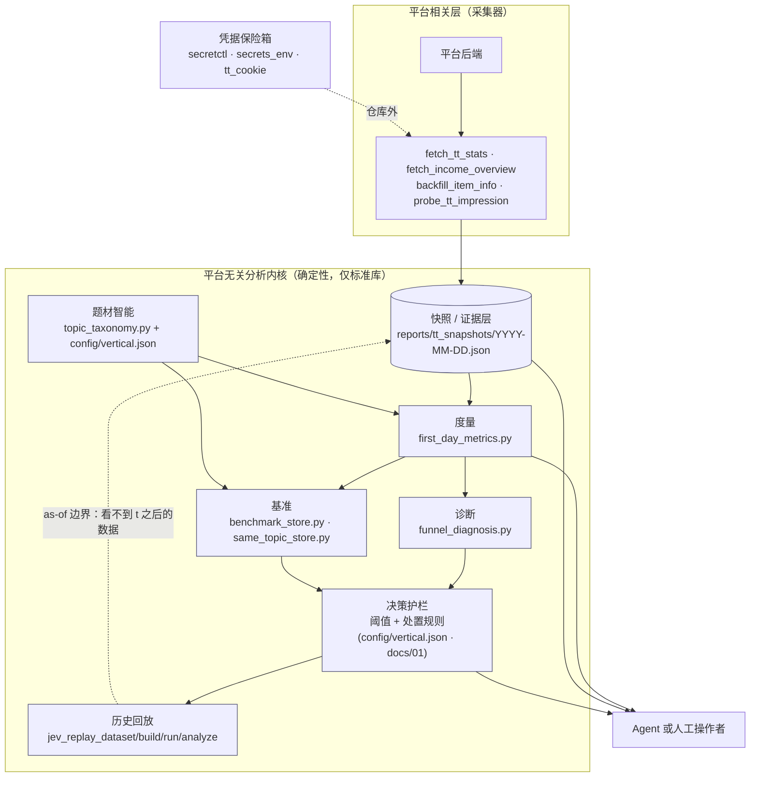

# ContentOps Loop

**Agent-compatible content intelligence & decision engine** —— 面向 Agent 接入的内容智能与决策引擎。

Measure → Diagnose → Act → Replay

> **Use code for facts. Use agents for judgment.**
> 事实交给代码，判断交给 Agent（或人）。

[English](README.md) | 简体中文

<!--
  徽章说明：下面的 CI 徽章必须在你 push、且第一次 CI 跑完之后才属实。
  把 <you>/<repo> 换成你的仓库，再取消注释：
  [](https://github.com/<you>/<repo>/actions/workflows/ci.yml)
-->


---

## 这个项目为什么存在

大多数内容数据工具回答的是 **「数字是多少」** —— 一个仪表盘、一张图、一份日报。
这是容易的一半。难的那一半是 **决定下一步做什么**，而且每次都用同一套标准来决定，
而不是每天早上重新推演一遍、顺带被这周碰巧看到的东西带偏。

ContentOps Loop 做的是后一半。它是一条小而确定的流水线：

- 把平台数据落成**版本化、可复现的快照**（证据）；
- 用**统一的分析窗口**度量，让两篇内容真的可比；
- 产出**带处置动作的诊断**，而不只是一张图；
- 把基准与题材词典当作**数据**而不是写死在代码里的假设；
- 能够**回放历史**，在采纳某条规则之前检验它当时是否有用 —— 且不把未来信息泄漏进过去。

它来自一个真实每天在跑的内容运营场景，所以对失败模式有明确态度：
凭据缺失、上游空响应、样本不足，以及"用三个数据点下结论"的诱惑。

**它不是什么：** 不是替你自动写稿发布的外挂，也不是无代码看板。度量链路里没有 LLM。

---

## 快速开始 —— 零凭据、零网络、零 API Key、零数据库

下面全部跑在自带的**合成数据集**上（宠物垂类，9 天，37 篇）。不需要平台账号、cookie 或 LLM。

```bash
git clone https://github.com/<you>/contentops-loop.git
cd contentops-loop

# 1. 环境自检 + 建工作区目录
python3 scripts/doctor.py --init

# 2. 核心演示：从合成快照产出度量报表 + 题材池子表
CONTENT_OPS_ROOT=examples python3 scripts/first_day_metrics.py
```

这一条命令就是整个项目的核心。它输出（真实运行结果，数据是合成的）：

```text
FIRSTDAY_OK (口径=首日曝光/首日阅读/首日CTR；快照 2026-01-13，可比样本 17 篇)
近5篇首日曝光中位 609｜近30天中位 865｜近5篇首日CTR中位 7.05%｜近30天 7.38%｜近14天CTR≥4%过线率 100.0%（17篇）

| 发布 | 题材 | 标题 | 首日曝光 | 首日阅读 | 首日CTR | 累计展 | 累计读 | 累计CTR |
|---|---|---|---|---|---|---|---|---|
| 2026-01-10 | 养猫日常 | 猫粮换了三个牌子，它终于肯吃了 | 1035 | 73 | 7.05% | 1536 | 79 | 5.14% |
| 2026-01-09 | 宠物训练 | 教了半年握手，它只学会了装听不懂 | 474 | 33 | 6.96% | 1090 | 39 | 3.58% |
| 2026-01-09 | 多宠与相处 | 新猫进门第七天，旧猫终于肯跟它一起睡了 | 609 | 59 | 9.69% | 1505 | 74 | 4.92% |
| 2026-01-09 | 多宠与相处 | 两只猫抢窝，我把猫爬架挪了个位置 | 554 | 28 | 5.05% | 1254 | 38 | 3.03% |

题材池子表（按「剔爆款后首日曝光中位」降序 = 池子大小序）：
| 题材 | 篇数 | 首日曝光中位(剔爆款) | 首日曝光中位(含爆款) | 首日阅读中位 | 首日CTR中位 | 备注 |
|---|---|---|---|---|---|---|
| 养猫日常 | 3 | 1178 | 1178 | 73 | 7.05% |  |
| 养狗日常 | 2 | 1130.0 | 1130.0 | 100.5 | 8.8% | |
| 宠物健康 | 3 | 908 | 908 | 67 | 7.38% | |
| 领养救助 | 2 | 851.0 | 851.0 | 74.0 | 8.71% | |
| 多宠与相处 | 2 | 581.5 | 581.5 | 43.5 | 7.37% | |
| 宠物殡葬离别 | 1 | 305 | 305 | 18 | 5.9% | 单篇 |
| 宠物消费 | 1 | 263 | 263 | 13 | 4.94% | 单篇 |
```

**这份输出想说明什么。** 看最后两行：**点击端并不差**（5.9% 和 4.94%，都在 4% 过线之上），
但**早期分发量很小**（305 和 263）。只看累计指标的看板会把这两篇和真正表现差的那篇混在一起，
统称"数据不好"。而这条流水线把 **「平台没给量」** 和 **「没人点」** 分开 ——
因为对应的补救动作是相反的：前者应该改标题/换封面重发，后者要换内容方向。

其他同样零凭据可以试的：

```bash
python3 scripts/vertical.py                                  # 查看垂类词典与阈值
python3 scripts/topic_taxonomy.py "我家橘猫半夜踩脸，一夜没睡好"   # 确定性分类器
python3 scripts/doctor.py --strict                           # 必需项缺失时返回非 0（给 CI 用）
python3 -m unittest discover -s tests -v                     # 测试套件
```

---

## 核心架构

刻意分成两层：**平台相关的采集器** 与 **平台无关的分析内核**。内核从不直接访问平台，只读快照。



图想表达两件事：

1. **内核是快照的纯函数。** 只要你能产出符合文档结构的快照，下游的度量/诊断/基准/回放全部可用，
   不需要采集器。
2. **回放反向喂给证据层，但边界是硬的。** 时刻 *t* 的回放单元只能看到 *t* 时已存在的数据；
   框架会检查这条边界，而不是依赖分析者自己记得。

---

## 核心能力

### 度量（Measurement）

`scripts/first_day_metrics.py` —— 每篇内容一个统一、可复现的分析窗口。

- 首日窗口（发布 ≤ 12:00 取当天；更晚取次日），避免"半天数据"和"全天数据"互相比较；
- 来源优先级：平台逐日流量数据优先，快照值作为**下限**使用并明确标注；
- 按标题去重（同一内容可能在一分钟内出现两次）；
- **剔爆款**：单个爆款不参与"稳定池中位"，避免一篇运气好的内容把小题材抬成大题材；
- 样本纪律：样本太少的题材只打标签，不给分数。

### 诊断（Diagnosis）

`scripts/funnel_diagnosis.py` —— 沿漏斗逐层走（分发 → 点击 → 完读 → 互动），给出卡点位置与**类型**，
让动作从诊断直接推出来。

处置表在 `docs/01-诊断口径.md`，阈值在 `config/vertical.json`。
这套框架**声称什么、不声称什么**见下面「设计原则」。

### 题材智能（Topic intelligence）

`scripts/topic_taxonomy.py` + `config/vertical.json` —— 确定性关键词分类，输出题材族 + 母题 +
命中的关键词 + 置信度。

刻意**不用 LLM 分类器**：分类决定了后续算哪些统计量，所以它必须可审计、可复现、能用一行词典改动修好。
未命中的标题如实报 `未归类` —— 工具不猜。

换垂类只需改一个 JSON，脚本不动。

### 基准（Benchmarking）

`scripts/benchmark_store.py` —— 存可比的外部内容，并且**只在同一文章年龄桶内**算分位数
（2 小时的内容和 3 周的内容不可比）。低于最小样本量的桶输出"样本不足"而不是给一个数字。
`same_topic_*.py` 提供按母题的视图与周卡。

### 决策护栏（Decision guardrails）

不是模块，而是一层**规范**，这正是重点。规则写在一处（`docs/01-诊断口径.md`），
数字写在一处（`config/vertical.json`），因此可以被审阅、被质疑、被有意识地修改：

- 每篇内容一个明确处置，而不是含糊的"表现一般"；
- 频次上限（例如同一篇内容每周最多重发一次）；
- 停更门带**否决条件** —— 点击端健康时门明确不触发，防止把分发问题误判成内容问题；
- 阈值是**标定产物**而不是常量：换垂类就应该重新标定。

### 历史回放（Historical replay）

`scripts/jev_replay_dataset.py` · `jev_replay_build.py` · `jev_replay_run.py` · `jev_replay_analyze.py`

用来回答 **"这条规则当时会有用吗"**，在采纳之前：

- 用时刻 *t* 可得的数据构造回放单元（as-of 切片）；
- 在单元上跑候选评估器（规则引擎，或可选的外部模型）；
- 报告增量价值，并显式检查**未来信息泄漏**。

它被用来**否掉**东西而不只是采纳：某外部标题打分服务在历史回放上没有增量信号，因此没有接入。

---

## Agent 接入

**Agent-compatible，不是 agent runtime。** 本项目不包含自主 Agent、MCP server 或 planner。
它提供的是一套**确定性内核 + agent-first CLI**，让 Agent（或 cron、CI、人）可以安全地驱动它：

| 特性 | 实现方式 |
|---|---|
| 机器可读的结果 | stdout 上的 `PREFIX:` 行（`COOKIE_EXPIRED:`、`SNAPSHOT:`、`FIRSTDAY_OK`、`DONE:` …） |
| 无歧义的失败 | 统一退出码：`0` 成功、`10` 凭据、`20` 上游、`30` 数据格式、`40` 数据不足、`50` 配置、`60` 完整性、`64` 用法（`scripts/exitcodes.py`） |
| 结构化结果 | `--json` 输出；落盘的 JSON 契约（`schemas/`） |
| 事实不重算 | 数字由脚本产出，Agent 被要求引用而不是重算 |
| 先自检 | `scripts/doctor.py [--strict]` 在跑任何东西之前报告环境/依赖/数据就绪度 |
| 配置与机制分离 | 词典和阈值在 `config/vertical.json`；Agent 可以改数据，改不动逻辑 |

一个最小的每日循环：

```bash
python3 scripts/fetch_tt_stats.py                          # 采集 → 快照
python3 scripts/first_day_metrics.py --json reports/first_day.json
# 把两条命令的 stdout 灌给 Agent，要求它：
# (a) 给每篇新内容一个处置；(b) 说明明天要决定的一件事；(c) 样本不足时直说"样本不足"而不是猜。
```

`docs/05-真实cron-prompt脱敏.md` 里有五条真实生产 prompt 的脱敏版（脚本注入式复盘、单一出口周决策、
可回复周卡、证据蒸馏、无 LLM 看门狗），以及值得抄的 11 个写法。

---

## 零凭据演示

`examples/` 是**合成**数据集：9 天 37 篇，目录结构与真实流水线写入的完全一致。
它的存在就是为了让内核可以在不接触任何平台的情况下被完整跑通。

```bash
CONTENT_OPS_ROOT=examples python3 scripts/doctor.py
CONTENT_OPS_ROOT=examples python3 scripts/first_day_metrics.py
```

`CONTENT_OPS_ROOT` 决定工作区根目录（默认 `~/content-ops-loop`），所以代码和数据可以放在任何地方。

---

## 凭据管理

内核不需要任何凭据。只有采集器需要会话，而仓库的设计保证凭据不会进来：

1. **仓库外的运行副本** —— `~/.cheat-secrets/tt_mp_cookies.txt`（权限 600），由 `scripts/tt_cookie.py` 读取；
2. **可选的加密保险箱** —— `scripts/secretctl.py` 用 AES-256-GCM 存储，每条独立 nonce，
   外加截断 SHA-256 完整性校验；**主密钥在仓库外**（`~/.cheat-secrets/master.key`），
   因此密文库文件本身可以安全备份或公开；
3. `.gitignore` 默认排除密文库、`*.env`、`*.key` 以及 `reports/` 数据目录。

主密钥丢失则库打不开 —— 这是设计取舍，请单独备份主密钥。

---

## 平台支持

**目前只有一个已实现的采集器：头条号。** 它是第一个 platform adapter，不是架构本身。

| 层 | 状态 |
|---|---|
| 分析内核（度量/诊断/题材/基准/回放） | 平台无关 —— 只读快照 JSON |
| 快照结构 | 见 `schemas/snapshot.schema.json` |
| 采集器 | 头条号专属 HTTP 接口（`fetch_tt_stats.py`、`fetch_income_overview.py` …） |
| 可选集成 | 安卓设备自动化（`phone_ctl.py`）、回放实验用的外部评估器 |

**不声称支持尚未实现的其他平台。** 增加一个平台 = 写一个产出同样快照结构的采集器，内核不用改。

---

## 设计原则

1. **先事实，后判断。** 采集与分析脚本只产证据，不产观点；方向变更是一个独立且有频次上限的步骤。
2. **能确定的地方就确定。** 同样输入 → 同样输出。用关键词词典而非 LLM 分类器；用写下来的阈值而非手感；
   平台时间戳一律按**固定平台时区**解释（`scripts/platform_time.py`），运行机器所在时区不影响结论。
3. **绝不隐藏证据不足。** 样本量守卫返回"样本不足"而不是一个看起来能用的数字；退出码 `40` 就是为此存在。
4. **回放必须防泄漏。** 回放单元只能看到它自己时间点之前存在的数据，且框架会检查边界。
5. **Agent 消费证据，而不是发明事实。** 指标由代码算一次，下游只引用。

### 这套诊断框架**不**声称什么

`docs/01-诊断口径.md` 里的分解（早期分发 ≈ 骨架新鲜度 × 题材池子大小 × 账号当期分配额度）是一个
**working diagnostic framework**，不是经过统计估计的因果模型。三项之间不独立，系数也无法从观测数据中识别。
它的价值在于**迫使不同的失败原因被分开排查**。所有平台侧的解释都标注为「解释」，不标注为「平台官方机制」。

---

## 目录结构

```text
contentops-loop/
├── scripts/                    # 27 个脚本：采集器 / 分析内核 / 保险箱 / 工具
│   ├── first_day_metrics.py    #   度量（项目核心）
│   ├── funnel_diagnosis.py     #   诊断
│   ├── topic_taxonomy.py       #   题材分类（确定性）
│   ├── benchmark_store.py      #   按文章年龄桶的基准
│   ├── same_topic_*.py         #   按母题的库 + 周卡
│   ├── jev_replay_*.py         #   防泄漏的历史回放
│   ├── secretctl.py            #   加密凭据保险箱
│   ├── secrets_env.py          #   保险箱读取接口
│   ├── tt_cookie.py            #   会话查找（仓库外优先）
│   ├── exitcodes.py            #   统一退出码语义
│   ├── platform_time.py        #   平台时区（不用本机时区）—— 确定性
│   ├── vertical.py             #   垂类词典/阈值加载器
│   ├── doctor.py               #   环境自检
│   └── fetch_*.py, probe_*.py  #   平台专属采集器
├── config/
│   ├── vertical.json           # ★ 题材词典 + 阈值（换垂类改这个）
│   └── README.md
├── schemas/                    # 数据边界的机器可读契约
├── examples/                   # 合成数据集 —— 零凭据可跑
├── tools/                      # CI 卫生检查（本地也能直接跑）
│   ├── check_core_imports.py   #   内核不得顶层 import 第三方库
│   └── scan_credentials.py     #   仓库不得包含凭据形状的内容
├── tests/                      # 确定性单元测试（标准库 unittest）
├── docs/
│   ├── MEASUREMENT.md          # 度量规范（英文）
│   ├── WHY.md                  # 架构决策记录（英文）
│   ├── 01-诊断口径.md            # 度量规范（中文，最完整）
│   ├── 02-工程决策与踩坑.md       # 工程决策与踩坑记录
│   ├── 03-数据字典.md            # 数据字典
│   ├── 04-换赛道-移植清单.md      # 换垂类：什么能复用、什么必须重来
│   └── 05-真实cron-prompt脱敏.md  # 五条真实生产 prompt（脱敏）
├── reports/                    # 流水线产出（默认被 gitignore）
└── .github/workflows/ci.yml    # 编译、测试、演示冒烟
```

`reports/` 被刻意 gitignore：流水线会把个人运营数据写在那里，不该被误提交。

---

## 测试

```bash
python3 -m unittest discover -s tests -v      # 全量测试（标准库 unittest，不需要 pytest）
python3 -m compileall -q scripts tests        # 语法/导入检查
CONTENT_OPS_ROOT=examples python3 scripts/first_day_metrics.py >/dev/null && echo "demo ok"
```

测试针对确定性内核：首日窗口选择、去重、剔爆款、输出确定性、题材分类的优先级与否决规则、
样本量守卫、文章年龄桶边界、回放的 as-of 切分与泄漏检测、保险箱往返与防篡改、以及无凭据环境下的退出码语义。

`tests/test_portability.py` 在四个不同 `TZ` 下各跑一遍 demo 与分类器，要求输出逐字节相同 ——
运行机器的时区不允许改变结论。

`tests/test_repo_hygiene.py` 专门挡一类**push 之后才会暴露**的事故：过宽的 `.gitignore` 规则把仓库需要
的文件静默排除掉。（曾经 `reports/` 吃掉 `examples/reports/` 整个合成数据集，`*secret*` 吃掉三个源码
文件 —— 本地全绿，新克隆的人却跑不起来。）只要有本该入库的文件被 ignore 规则命中，这个测试立刻失败。

`tests/test_schemas.py` 用仓库内自带的极小校验器（不引入第三方依赖）验证 examples 里的快照
与现场产出的 `first_day_metrics --json` 是否符合 `schemas/`；同时断言**故意构造的坏数据必须校验失败** ——
否则校验器本身就没有被测过。

---

## 安全与隐私

- 仓库不应包含真实账号标识、cookie、token、真实文章数据或私人运营数据。自带数据集是合成的。
- 凭据存在仓库外，或者存在一个主密钥位于仓库外的 AES-256-GCM 保险箱里（`scripts/secretctl.py`）。
  仓库里没有任何东西需要凭据才能运行。
- `reports/`、`*.env`、`*.key` 与密文库文件默认被 gitignore。
- 如果你 fork 之后接入真实账号：遵守平台服务条款与当地法律是你的责任。采集器只使用你提供的会话
  读取**你自己账号**的后台数据。

---

## Roadmap

尚未实现 —— 列出来是为了让缺口明确：

- **更多平台适配器**（采集器接口目前只是约定，把它变成显式的、有文档的契约是第一步）；
- **跨平台统一的版本化快照 schema**（现在是"有文档但写入时不校验"）；
- **更强的回放评估**：更多评估器、置信区间、正规的 backtest 协议；
- **更丰富的 Agent 接入**：一份机器可读的命令清单，让 Agent 不必解析 `--help` 就能发现脚本、输入与退出码；
- **更多测试**，尤其是采集器（目前刻意为零：它们需要网络）；
- **正式 CLI**（`contentops <command>`）而不是一个脚本一个入口；
- **中文深度文档的英文版**。

---

## 贡献

欢迎 issue 与 PR。几点实务约定：

- 确定性内核必须保持零运行时第三方依赖；可选功能要能优雅降级
  （参考 `secretctl.py` 与 `phone_ctl.py` 在缺少依赖时的处理）。
- 任何触及度量窗口、阈值、词典的改动，都应该带一个测试，并在 `docs/WHY.md` 里补一行理由。
- 新增采集器请产出既定快照结构，不要去改内核。
- 提 PR 前请跑一遍「测试」一节里的命令。

---

## License

MIT —— 见 [LICENSE](LICENSE)。
